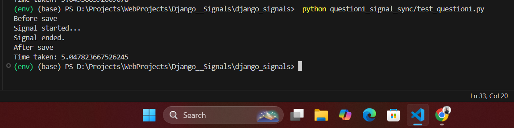
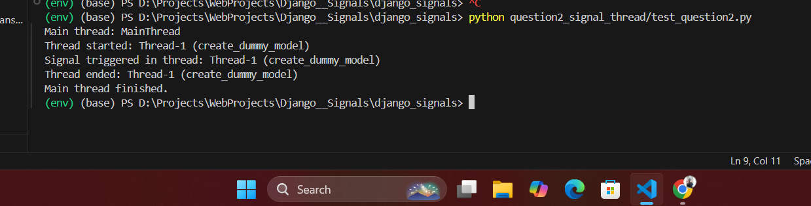
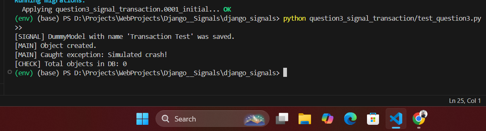
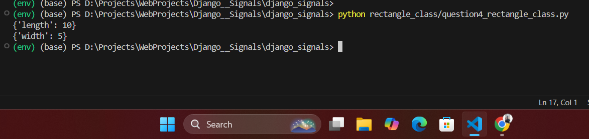

# Django Signals Project

This project explores the concept of **signals in Django** through four different questions, providing code-based proof and demonstration for each case.

---

## 📘 What is a Signal in Django?

In Django, **signals** allow certain senders to notify a set of receivers when specific actions have taken place. It is a way of **decoupling** different parts of your application while allowing them to communicate.

For example:
- When a model is saved, you may want to automatically log the change, send an email, or update a cache.
- Instead of adding that logic directly to the model or view, you can use a signal to listen for the save event and react to it independently.

Django provides some built-in signals like `post_save`, `pre_save`, `post_delete`, etc., and you can create **custom signals** as well.

---

## ✅ Questions & Answers

---

### 🔹 Question 1:By default are django signals executed synchronously or asynchronously?

**Answer**: **synchronous**


Yes, by default, Django signals are **synchronous**. When a signal is sent (e.g., using `post_save`), the handler is called **immediately** and **within the same thread**.

**Proof Location**:  
📁 `question1_signal_sync/`  
📄 Run `test_question1.py` to see the signal being handled synchronously.

📸 Output:
   


---

### 🔹 Question 2:  Do Django signals run in the same thread as the caller?

**Answer**:  
By default, Django signals run in the same thread as the caller. Django signals are synchronous and block the caller until the signal handlers finish executing. They do not run in a separate thread unless explicitly configured to do so. 

However, it is possible to execute signal handlers in a separate thread by creating a custom threaded signal handler. This can be done by using Python’s threading module or other threading libraries to spawn a new thread for the handler.

**Proof Location**:  
📁 `question2_signal_thread/`  
📄 Run `test_question2.py` to see how the signal can be manually handled in a separate thread using Python's `threading` module.

📸 Output:
   


---

### 🔹 Question 3:By default, do Django signals run in the same database transaction as the caller?

**Answer**:  
By default, Django signals run in the same database transaction as the caller. This means that if the caller's database transaction is committed, the signal will also be committed. Conversely, if the transaction is rolled back, the signal will not be executed or committed either.

For example, signals like post_save are triggered within the same transaction as the model save. If the transaction fails or is rolled back, the signal handler will not be executed, ensuring the integrity of the transaction.

**Proof Location**:  
📁 `question3_signal_transaction/`  
📄 Run `test_question3.py` to see how a raised exception rolls back both model save and the signal logic.

📸 Output:
   


---

### 🔹 Question 4: Python Rectangle class that supports iteration

**Description**:  
A simple Python class named `Rectangle` that:
- Requires `length` and `width` during initialization
- Is iterable: returns `{'length': value}` first, then `{'width': value}`

**Proof Location**:  
📄 File: `question4_rectangle_class.py`  
📸 Output:
   


📄 Run this file directly using:
```bash
python rectangle_class/question4_rectangle_class.py

📸 Output:
for the output look at   
